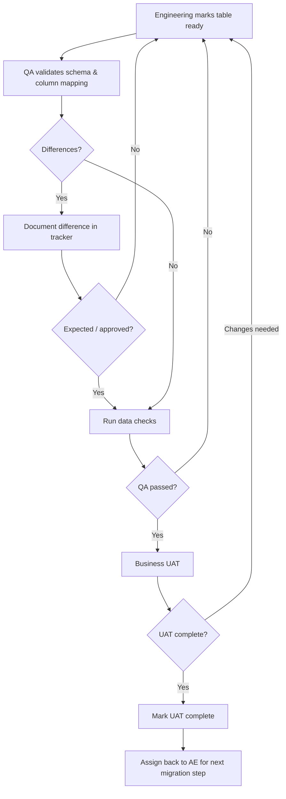

# Per-Table QA & UAT Validation Guide

## Purpose

Use this workflow for each migrated table. The goal is to make validation repeatable, auditable, and easy to hand off between engineering, QA, and the business team.

## QA checklist

| Check | Evidence |
|---|---|
| Source and target objects confirmed | Object names/links |
| Column mapping validated | Mapping comparison |
| Data types validated | Schema result |
| Differences documented | Tracker entry |
| Row/aggregate checks completed | Query output or QA result |
| Refresh timing considered | Timestamp comparison |
| QA outcome recorded | Pass/fail + reviewer |

## UAT checklist

UAT should answer whether the table is usable for the business purpose—not repeat every engineering test. Validate representative business scenarios, expected fields and measures, known transformations, and refresh expectations. Record approval and any accepted differences.

## Handoff rule

After UAT is marked complete, assign the item back to **AE** for the next migration/cutover step. Do not leave a completed UAT item without an owner.
