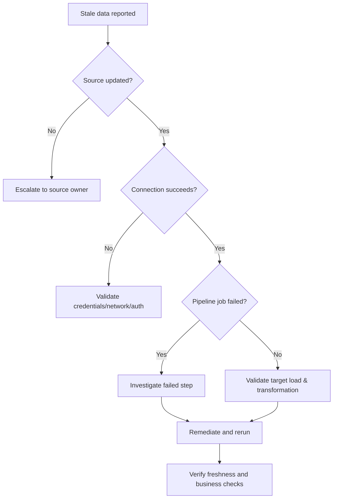

# Runbook: Data Pipeline Is Stale

## Use when

A downstream table or report has not received data within its documented refresh window.

## Initial triage

1. Confirm the expected refresh schedule and timezone.
2. Check the last successful target timestamp.
3. Determine whether the issue affects one object, one source, or the full pipeline.
4. Check orchestration/job status and the first failed step.
5. Capture the error message and run identifier before retrying.

## Decision path

## Recovery verification

Do not close the incident when the job merely turns green. Confirm the target timestamp, expected record/metric behavior, downstream availability, and whether a backfill is required.

## Escalate with

- Affected source and target
- Expected vs. actual refresh time
- Last successful run
- Failed step and error
- Business impact
- Actions already attempted
- Backfill requirement
